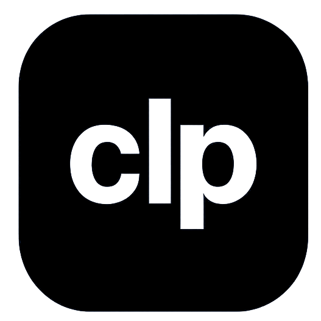

<div align="center">

  
  <h1>clp</h1>
  
  <p>
    <strong>The Native Windows Clipboard Upgrade.</strong>
  </p>

  <p>
    <a href="https://github.com/AdityaVN5/clp/releases/latest">
      
    </a>
    <a href="https://tauri.app">
      
    </a>
    <a href="https://react.dev">
      
    </a>
    <a href="https://www.rust-lang.org">
      
    </a>
  </p>

  <p>
    <a href="#-downloads"><strong>Download Now</strong></a> •
    <a href="#-features">Features</a> •
    <a href="#-build-from-source">Build</a>
  </p>
</div>

---

## 🚀 Overview

**clp** is a modern, lightweight rethink of the Windows clipboard manager. Built with **Rust** and **Tauri**, it uses a fraction of the memory of Electron apps while delivering a beautiful, native-feeling UI.

It's designed to be the "missing piece" of Windows.
Fast, Unobtrusive, and Powerful.

## ✨ Features

- **⚡ Blazing Fast**: Powered by a Rust backend. fast startup, low memory usage.
- **🎨 Visual History**: See your copy history with rich previews for text and images.
- **📂 Smart Collections**: Organize clips into "Links", "Code", "Images" automatically or manually.
- **🔍 Instant Search**: Find that one thing you copied 3 hours ago in milliseconds.
- **⌨️ Global Hotkey**: `Ctrl+Shift+V` to toggle anywhere (Customizable).
- **🌙 Theme Aware**: Seamlessly adapts to your system's Light or Dark mode.
- **🔒 Private**: Your data stays local. No cloud syncing, no tracking.

## 📦 Downloads

| Version       | Description                          | Link                                                                                                             |
| :------------ | :----------------------------------- | :--------------------------------------------------------------------------------------------------------------- |
| **Installer** | RECOMMENDED. Standard Windows setup. | [⬇️ Download Setup (.exe)](https://github.com/AdityaVN5/clp-src/releases/download/v1.0.0/clp_1.0.0_x64-setup.exe)    |
| **Portable**  | No install needed. Unzip and run.    | [💼 Download Portable (.zip)](https://github.com/AdityaVN5/clp-src/releases/download/v1.0.0/clp-portable.zip) |

## 🛠️ Build from Source

Requirements:

- [Node.js](https://nodejs.org/) (v16+)
- [Rust](https://www.rust-lang.org/) (v1.70+)

```bash
# Clone the repository
git clone https://github.com/AdityaVN5/clp.git
cd clp

# Install frontend dependencies
npm install

# Run in development mode
npm run tauri dev

# Build for production
npm run tauri build
```

## 📜 License

[MIT License](LICENSE) © 2024 AdityaVN5
